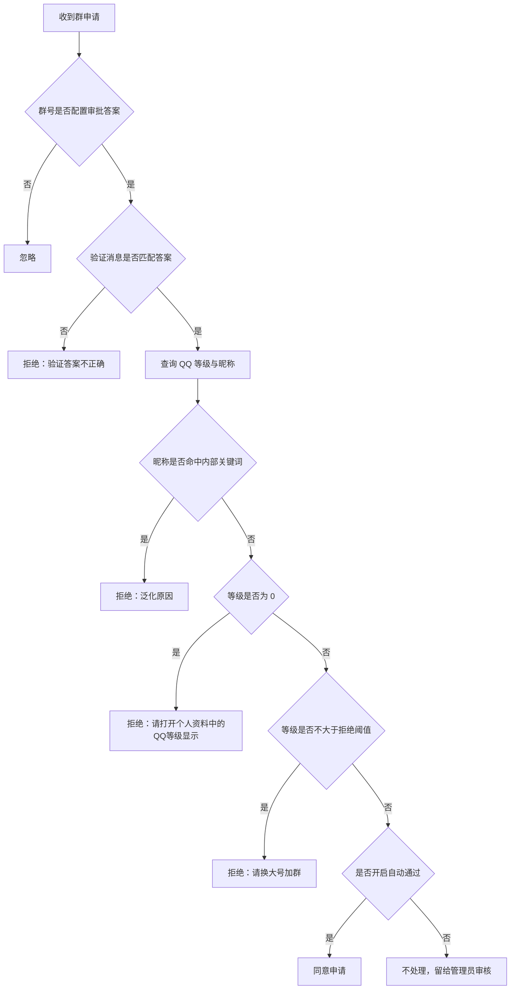

# astrbot_plugin_groupJoinInspector

基于 NapCat/aiocqhttp 的 AstrBot 群入群申请检查与低可信新成员兜底验证插件。

插件主要处理“入群申请审批”事件：按群号匹配配置的审批答案，查询申请人 QQ 等级和昵称，并在答案错误、0级、低等级或名称命中内部风控关键词时拒绝申请并填写泛化拒绝原因。同时，插件也可以在配置过审批答案的群内，对入群后仍未满足可信放行规则的新成员发起算术验证，超时未通过时踢出但不拉黑。

仓库地址：<https://github.com/Catfish872/astrbot_plugin_groupJoinInspector>

## 功能

- 按群号配置不同的审批答案。
- 检查入群申请验证消息，也就是 OneBot 申请事件中的 `comment`。
- 查询申请人 QQ 等级，优先读取 NapCat `get_stranger_info` 返回的 `qqLevel`。
- 0级申请直接拒绝，默认原因：`请打开个人资料中的QQ等级显示`。
- QQ 等级不大于配置阈值时拒绝，默认原因：`请换大号加群`。
- 支持按申请人昵称配置内部风控关键词，例如昵称包含 `頟` 时拒绝申请。
- 支持答案正确且等级合格后自动通过，也可以默认留给管理员审核。
- 支持管理员手动资料调试，用于查看 `get_stranger_info` 实际返回的字段，辅助确认公司、性别、生日/星座等资料是否可用于审批风控。
- 支持入群后低可信兜底算术验证：只对已配置审批答案的群生效，空间、资料、VIP、等级、账号年龄等可信规则全部不满足时，要求新人直接在群内回答算术题。
- 审批和验证记录写入 AstrBot 数据目录，不写入插件目录。

## 默认流程



## 配置项

主要配置项位于 `_conf_schema.json`。

### 群号与审批答案

`approval_rules` 使用 AstrBot 支持的列表对象配置。WebUI 中可以点“添加”新增一条规则，每条规则包含：

- `group_id`：群号，例如 `12345`。
- `answer`：审批答案，例如 `这里是答案`。

配置效果相当于：

```text
[12345, "这里是答案"]
```

也兼容直接填写文本格式：

```text
[12345, '这里是答案']
12345:这里是答案
```

如果同一个群号配置多条规则，后面的规则会覆盖前面的规则。

### 等级策略

- `reject_level_threshold`：低等级拒绝阈值，默认 `5`。QQ 等级不大于该值时拒绝。
- `low_level_reject_reason`：低等级拒绝原因，默认 `请换大号加群`。
- `reject_zero_level`：0级直接拒绝，默认开启。
- `zero_level_reject_reason`：0级拒绝原因，默认 `请打开个人资料中的QQ等级显示`。
- `reject_unknown_level`：无法获取等级时拒绝，默认开启。
- `unknown_level_reject_reason`：无法获取等级拒绝原因。

说明：0级策略优先于低等级阈值。也就是说，等级为 `0` 时先使用 `zero_level_reject_reason`，不会使用 `low_level_reject_reason`。

### 名称威胁情报

- `threat_name_keywords`：名称关键词列表，默认包含 `頟`。申请人昵称包含任一关键词时拒绝申请。
- `threat_name_case_sensitive`：名称关键词大小写敏感，默认开启。
- `threat_name_reject_reason`：名称关键词拒绝原因，默认 `请换大号加群`。

该功能用于把你掌握的灰产账号昵称模式作为内部风控规则使用。例如关键词配置为 `頟` 后，`頟頟`、`遂乐頟` 这类昵称都会被拒绝。

重要：拒绝原因必须保持泛化，不要写出命中的关键词、风险特征或威胁情报来源。否则对方看到原因后可以直接改名绕过。

### 答案比较

- `answer_trim`：比较答案时去掉首尾空白，默认开启。
- `answer_case_sensitive`：答案大小写敏感，默认开启。
- `answer_mismatch_reject`：答案错误时自动拒绝，默认开启。
- `answer_mismatch_reason`：答案错误拒绝原因，默认 `验证答案不正确`。

NapCat 实际传入的验证消息常见格式是：

```text
问题：123
答案：123
```

插件会优先提取最后一个 `答案：`、`答案:`、`回答：` 或 `回答:` 后面的内容，再与配置答案比较。因此配置答案只需要填写 `123`，不需要包含 `问题：` 或 `答案：` 前缀。

### 自动通过

- `auto_approve_passed`：答案正确且等级合格时是否自动通过，默认关闭。
- `approve_reason`：自动通过原因，默认 `欢迎加入`。

默认关闭自动通过，是为了让插件只自动挡掉明显不符合条件的申请，剩余申请仍由管理员审核。

## 入群后低可信兜底验证

该功能由 `post_join_verification_enabled` 控制，默认开启。它只对 `approval_rules` 中配置过审批答案的群生效，不额外维护群列表。

新人入群后，插件会检查以下可信放行规则；满足任意一条就不打扰：

- QQ 空间可访问：QQ 空间接口 `code=0` 且 `subcode=0`，不要求空间里有说说。
- 个人资料有效条目数达到阈值：默认 `post_join_profile_min_effective_items = 2`。
- 任意 VIP：`is_vip`、`is_years_vip` 或 `vip_level > 0`。
- QQ 等级达到高质量号阈值：默认 `post_join_qq_level_min = 30`。
- 账号年龄达到阈值：通过 `get_stranger_info` 的 `reg_time` 计算，默认 `post_join_account_min_days = 1825`，约 5 年。

如果全部可信规则都不满足，插件会在群内 @ 新人并发送一道简单算术题。用户不需要 @ 机器人，只要在群内直接发送唯一的数字答案即可。默认超时时间是 `120` 秒；超时未答对会踢出，但不拉黑，也不拒绝再次申请。

公开提示语不要暴露“空间不可访问”“资料极简”“低可信”等风控原因，避免对方针对性绕过。

相关配置项：

- `post_join_verification_enabled`：启用入群后低可信兜底验证。
- `post_join_verification_timeout_seconds`：算术验证超时时间，默认 `120` 秒。
- `post_join_profile_min_effective_items`：资料有效条目放行阈值，默认 `2`。
- `post_join_qzone_access_enabled`：启用 QQ 空间可访问放行规则。
- `post_join_qzone_timeout_seconds`：QQ 空间检查超时时间，默认 `8` 秒。
- `post_join_vip_trust_enabled`：启用 VIP 放行规则。
- `post_join_qq_level_trust_enabled`：启用高 QQ 等级放行规则。
- `post_join_qq_level_min`：高 QQ 等级放行阈值，默认 `30`。
- `post_join_account_age_trust_enabled`：启用账号年龄放行规则。
- `post_join_account_min_days`：账号年龄放行天数，默认 `1825`。
- `post_join_verification_prompt_template`：算术验证提示语。
- `post_join_verification_success_template`：验证通过提示语。
- `post_join_verification_kick_template`：超时踢出提示语。

## 管理员调试指令

指令组：`/审批检查`

别名：`/joininspector`、`/入群审批`

所有调试指令均要求 AstrBot 管理员权限。

### 资料调试

```text
/审批检查 资料调试 <QQ>
```

该指令会调用 NapCat/OneBot 的 `get_stranger_info`，输出目标 QQ 的原始资料字段摘要。当前用于验证审批阶段能否拿到你关心的公司、性别、生日/星座等字段，不会自动拒绝申请。

输出重点：

- `性别原始值`：`male`、`female` 视为有性别；`unknown`、空、保密类值视为无性别。
- `生日字段`：存在有效生日月日时视为可推导星座；缺失、0、未填类值视为无星座。
- `疑似公司字段`：自动扫描字段名中包含 `company`、`corp`、`work`、`business`、`employ`、`office`、`公司`、`单位`、`企业` 的字段。
- `关键字段` 和 `其他字段名`：用于观察 NapCat 当前版本实际返回了哪些资料字段。

调试结果也会写入 `actions.jsonl`，包含原始返回，方便后续对灰产样本和正常样本做对比。

## 前提

- AstrBot 使用 aiocqhttp 平台适配器。
- OneBot 服务端建议使用 NapCat。
- 群加群方式建议设置为“回答问题并由管理员审核”。
- 机器人需要是对应群的管理员或群主，否则无法审批申请。


## 数据存储

插件会在 AstrBot 数据目录下创建：

- `actions.jsonl`：审批处理记录、入群后可信规则判断摘要、算术验证结果，也会记录管理员手动资料调试的原始返回。

这些文件不存放在插件自身目录，更新插件时不会丢失。

## 注意事项

- NapCat 支持在 `set_group_add_request` 中传入 `reason`，拒绝原因会传给 QQ 的群申请处理接口。
- QQ 客户端最终如何展示拒绝原因，取决于 QQ 客户端和服务端行为。
- 如果申请人隐藏等级或接口返回 0，插件会按 0级策略处理。
- 如果接口没有返回等级字段或调用失败，插件会按无法获取等级策略处理。
- 名称关键词属于内部威胁情报，拒绝原因中不要暴露关键词或“命中风险特征”等提示。
- 入群后算术验证状态只保存在内存中，不做持久化；如果机器人在验证窗口内重启，待验证状态会丢失。
- QQ 空间可访问规则依赖 `aiohttp` 和 NapCat 的 `get_cookies(domain="user.qzone.qq.com")`，Cookie 失效或接口异常时只会导致该可信规则不通过，不会直接踢人。
