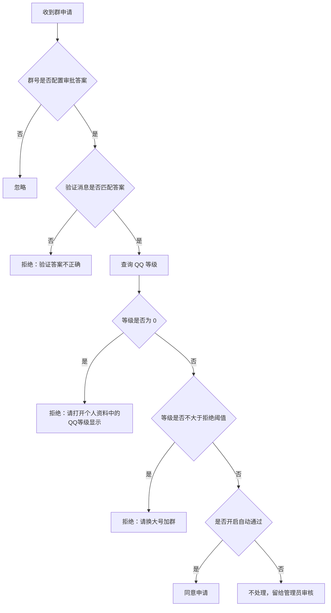

# astrbot_plugin_groupJoinInspector

基于 NapCat/aiocqhttp 的 AstrBot 群入群申请检查插件。

插件只处理“入群申请审批”事件：按群号匹配配置的审批答案，查询申请人 QQ 等级，并在答案错误、0级或低等级时拒绝申请并填写拒绝原因。

仓库地址：<https://github.com/Catfish872/astrbot_plugin_groupJoinInspector>

## 功能

- 按群号配置不同的审批答案。
- 检查入群申请验证消息，也就是 OneBot 申请事件中的 `comment`。
- 查询申请人 QQ 等级，优先读取 NapCat `get_stranger_info` 返回的 `qqLevel`。
- 0级申请直接拒绝，默认原因：`请打开个人资料中的QQ等级显示`。
- QQ 等级不大于配置阈值时拒绝，默认原因：`请换大号加群`。
- 支持答案正确且等级合格后自动通过，也可以默认留给管理员审核。
- 审批记录写入 AstrBot 数据目录，不写入插件目录。

## 默认流程



## 配置项

主要配置项位于 `_conf_schema.json`。

### 群号与审批答案

`approval_rules` 使用 AstrBot 支持的列表对象配置。WebUI 中可以点“添加”新增一条规则，每条规则包含：

- `group_id`：群号，例如 `12345`。
- `answer`：审批答案，例如 `这里是答案`。

配置效果相当于：

```text
[12345, "这里是答案"]
```

也兼容直接填写文本格式：

```text
[12345, '这里是答案']
12345:这里是答案
```

如果同一个群号配置多条规则，后面的规则会覆盖前面的规则。

### 等级策略

- `reject_level_threshold`：低等级拒绝阈值，默认 `5`。QQ 等级不大于该值时拒绝。
- `low_level_reject_reason`：低等级拒绝原因，默认 `请换大号加群`。
- `reject_zero_level`：0级直接拒绝，默认开启。
- `zero_level_reject_reason`：0级拒绝原因，默认 `请打开个人资料中的QQ等级显示`。
- `reject_unknown_level`：无法获取等级时拒绝，默认开启。
- `unknown_level_reject_reason`：无法获取等级拒绝原因。

说明：0级策略优先于低等级阈值。也就是说，等级为 `0` 时先使用 `zero_level_reject_reason`，不会使用 `low_level_reject_reason`。

### 答案比较

- `answer_trim`：比较答案时去掉首尾空白，默认开启。
- `answer_case_sensitive`：答案大小写敏感，默认开启。
- `answer_mismatch_reject`：答案错误时自动拒绝，默认开启。
- `answer_mismatch_reason`：答案错误拒绝原因，默认 `验证答案不正确`。

NapCat 实际传入的验证消息常见格式是：

```text
问题：123
答案：123
```

插件会优先提取最后一个 `答案：`、`答案:`、`回答：` 或 `回答:` 后面的内容，再与配置答案比较。因此配置答案只需要填写 `123`，不需要包含 `问题：` 或 `答案：` 前缀。

### 自动通过

- `auto_approve_passed`：答案正确且等级合格时是否自动通过，默认关闭。
- `approve_reason`：自动通过原因，默认 `欢迎加入`。

默认关闭自动通过，是为了让插件只自动挡掉明显不符合条件的申请，剩余申请仍由管理员审核。

## 前提

- AstrBot 使用 aiocqhttp 平台适配器。
- OneBot 服务端建议使用 NapCat。
- 群加群方式建议设置为“回答问题并由管理员审核”。
- 机器人需要是对应群的管理员或群主，否则无法审批申请。

## 与 groupJoinFilter 的区别

`astrbot_plugin_groupJoinInspector` 只处理入群申请审批，不处理已经入群后的禁言、踢出或观察列表。

如果同时使用 `astrbot_plugin_groupJoinFilter`：

- 本插件负责申请阶段的答案和等级审批。
- `astrbot_plugin_groupJoinFilter` 负责入群后的等级过滤、黑白名单、0级观察等。

为了避免重复处理，可以根据实际需求关闭其中一个插件的申请检查功能。

## 数据存储

插件会在 AstrBot 数据目录下创建：

- `actions.jsonl`：审批处理记录。

这些文件不存放在插件自身目录，更新插件时不会丢失。

## 注意事项

- NapCat 支持在 `set_group_add_request` 中传入 `reason`，拒绝原因会传给 QQ 的群申请处理接口。
- QQ 客户端最终如何展示拒绝原因，取决于 QQ 客户端和服务端行为。
- 如果申请人隐藏等级或接口返回 0，插件会按 0级策略处理。
- 如果接口没有返回等级字段或调用失败，插件会按无法获取等级策略处理。
